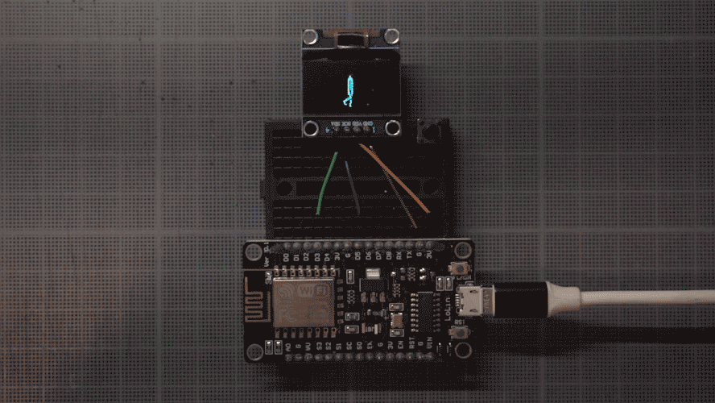

# tiny animations
arduino code for displaying 6-frame animation cycles using a node MCU board and a 128x64 i2c screen.

you only need to flash your board with the .ino and the images.h files. the rest is provided as context.
I used photoshop to produce each frame as a 128x64 bmp (with each pixel being either black or white), and then used an online converter (https://www.online-utility.org/image_converter.jsp) to turn them into .xbm files. then I opened each file and pasted the hex data into the image.h file, properly formatted. for some reason, frames are displayed inverted, so I load the bmps with the inverted colors.
